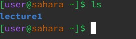
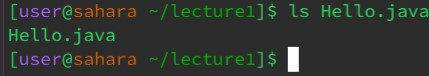
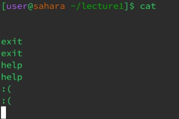
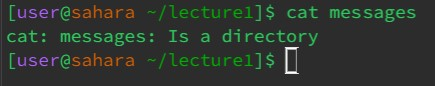
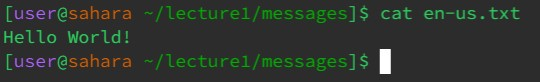

# Lab Report 1

## `cd` command

Using the command without arguments:

* Working directory was `/home`
* Having no arguments with the `cd` command lead to nothing happening. A new command line opened with there being no changes to anything related to the directory.
* The output was not an error.

Using the command with a path to a directory as an argument: 

* Working directory was `/home`
* Having a directory as the argument for the `cd` command lead to the working directory being changed from `/home` to `/home/lecture1`.
* The output was not an error.

Using the command with a path to a file as an argument:

* Working directory was `/home/lecture1`
* Having a file as an argument for the `cd` command lead to the terminal spitting out the error `bash: cd: Hello.java: Not a directory`.
* The output was an error because the `cd` command only works on changing directory so if we attempt to put in a file as the argument it will get upset with us.

## `ls` command

Using the command without arguments:

* Working directory was `/home`
* Having no arguments with the `ls` command lead to the all the files and folders in the `/home` directory being printed (in this case there was only the `lecture1` folder).
* The output was not an error

Using the command with a path to a directory as an argument:

* Working directory was `/home`
* Having a directory as the argument for the `ls` command lead to all the contents of the directory being printed out.
* The output was not an error.

Using the command with a path to a file as an argument:

* Working directory was `/home/lecture1`
* Having a file as the argument for the `ls` command lead to the file we used as the argument being printed out (in this case the `Hello.java` was printed out).
* The output was not an error.

## `cat` command

Using the command without arguments:

* Working directory was `/home/lecture1`
* Having no arguments with the `cat` command caused the terminal to become bugged. As a result of this I had to create a new terminal.
* There was no error code outputted but it did cause the terminal to become bugged.

Using the command with a path to a directory as an argument:

* Working directory was `/home/lecture1`
* Having a path to a directory as an argument caused the terminal to print out `cat: messages: Is a directory` to be printed out.
* The output was an error that notified me that the argument I tried to use `cat` on was a directory and not a file.

Using the command with a path to a file as an argument:

* Working directory was `/home/lecture1`
* Having a path to a file as an argument caused the terminal to print out the contents of the file ( In this case the contents of `en-us.txt` were printed out).
* The output was not an error.
